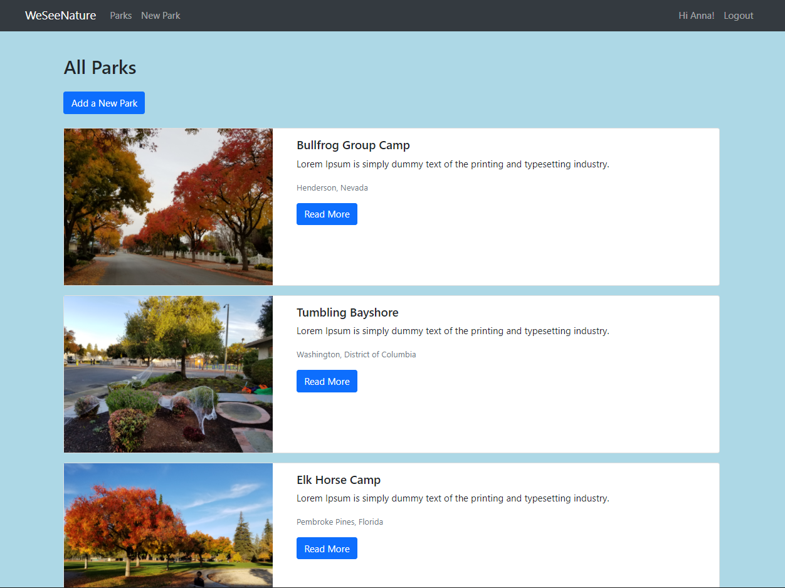
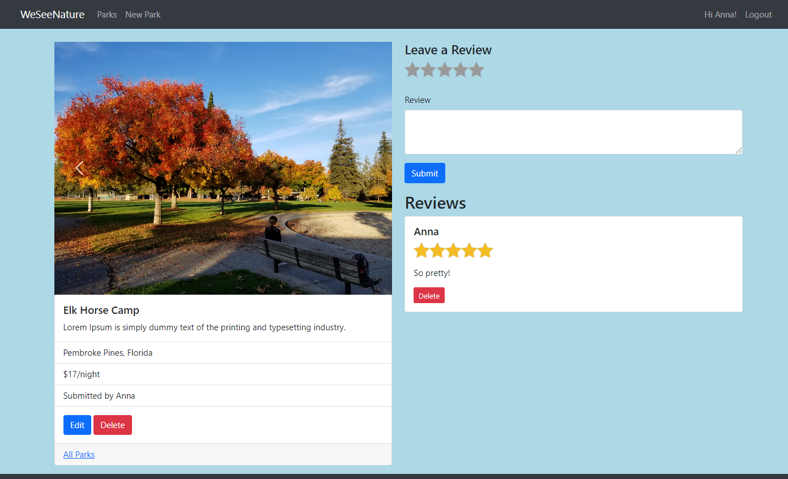
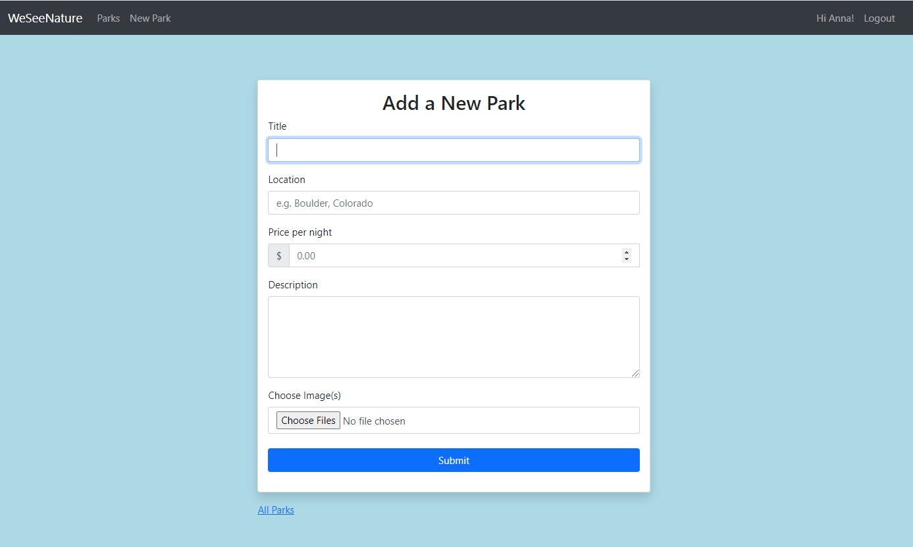
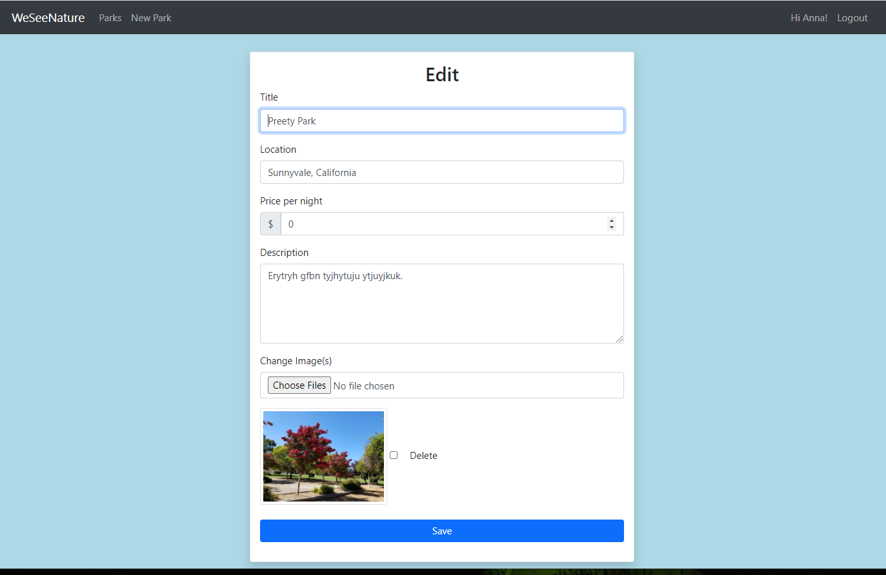

# ParksNode
<h2>A website with user-generated content. Node.js, Express.js, MongoDB, Bootstrap 5.</h2>

Users can add/edit/delete posts with park details (name, photos, description, location) and leave/delete reviews.

